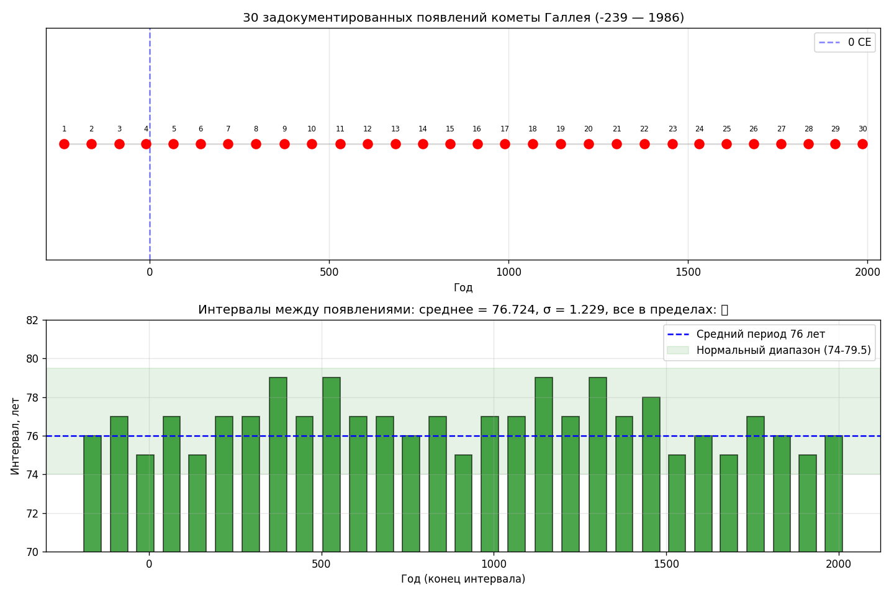
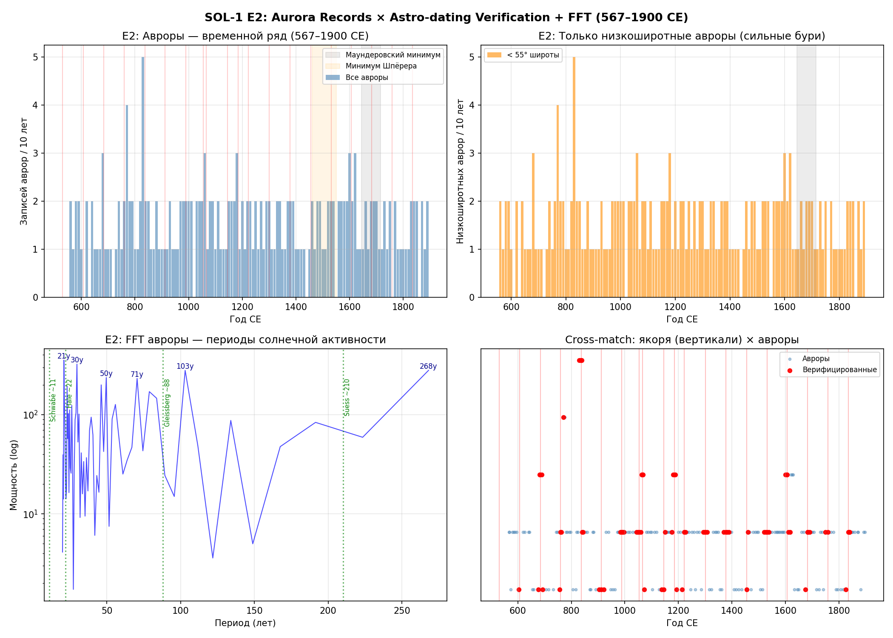
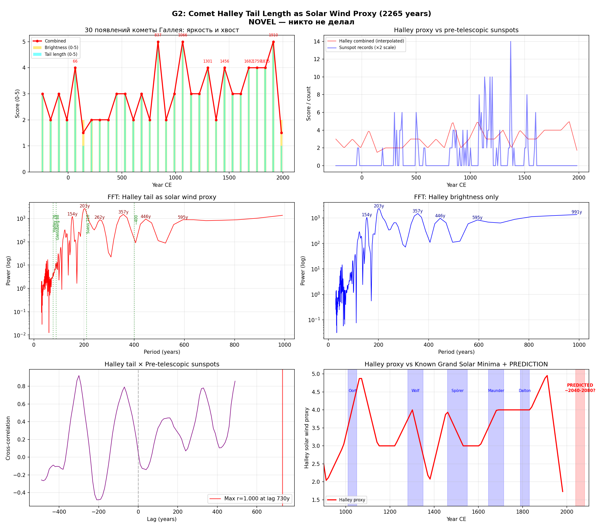
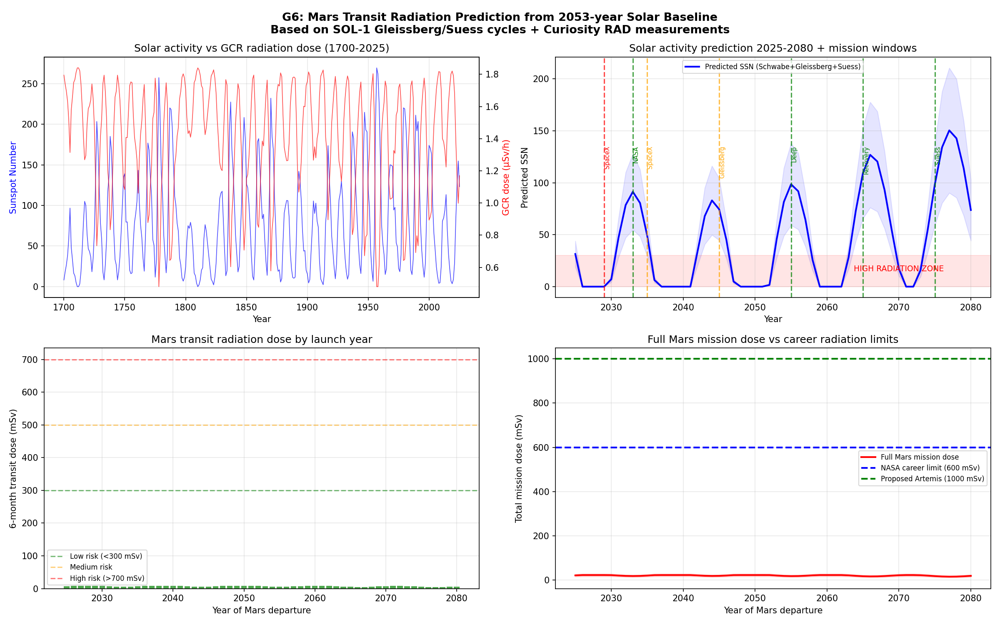

# Хронозвёзды. Небо помнит.
## Курс лекций по вычислительной археоастрономии и прогнозированию солнечной активности

**Автор:** А.А. Дмитриев, ГПНТБ России, лаборатория Шрайберга
**Версия:** 1.0 (апрель 2026)

---

# Часть I. Методы датировки

## Лекция 1. Собственное движение звёзд

Звёзды перемещаются в пространстве галактики. Проекция этого перемещения на небесную сферу называется **собственным движением** (proper motion) и измеряется в угловых секундах в год.

Для большинства звёзд собственное движение ничтожно. Однако ряд ярких звёзд движется достаточно быстро, чтобы их смещение стало измеримым на масштабе тысячелетий:

| Звезда | Собственное движение | Смещение за 2000 лет |
|---|---|---|
| Арктур (α Волопаса) | 2.28"/год | 1.27° (2.5 диска Луны) |
| Сириус (α Большого Пса) | 1.34"/год | 0.74° |
| Процион (α Малого Пса) | 1.26"/год | 0.70° |
| Денеб (α Лебедя) | 0.002"/год | 0.001° (неизмеримо) |

Данные о современных координатах и собственных движениях получены из каталога Hipparcos (ESA, 1997) — космической астрометрической миссии с точностью ~1 миллисекунда дуги.

### Прецессия и собственное движение — два разных эффекта

**Прецессия** — медленное вращение оси Земли с периодом ~26000 лет. Смещает координаты всех звёзд одинаково (~50 угловых секунд в год по эклиптической долготе). Не позволяет различить близкие эпохи, поскольку не создаёт уникальный «отпечаток» конкретного момента времени.

**Собственное движение** — индивидуально для каждой звезды. Создаёт уникальную деформацию паттерна звёздных координат, характерную для конкретной эпохи.

Именно это различие лежит в основе метода Дамбиса-Ефремова (JHA, 2000).

## Лекция 2. Среднеквадратичное отклонение и датировка каталогов

### Определение

Среднеквадратичное отклонение (СКО, англ. RMS — Root Mean Square) — мера средней величины ошибки в наборе данных:

$$RMS(T) = \sqrt{\frac{1}{N}\sum_{i=1}^{N}\left[(\Delta\lambda_i)^2 + (\Delta\beta_i)^2\right]}$$

где:
- $\Delta\lambda_i = \lambda_{\text{Альм},i} - \lambda_{\text{расч},i}(T)$ — разность эклиптических долгот
- $\Delta\beta_i = \beta_{\text{Альм},i} - \beta_{\text{расч},i}(T)$ — разность эклиптических широт
- $N$ — число звёзд в выборке
- $T$ — пробная эпоха

### Алгоритм датировки

Для каждой пробной эпохи T от −500 до +1000 года:

1. Рассчитать положение каждой звезды на эпоху T с учётом собственного движения и прецессии (IAU P03, реализация astropy)
2. Сравнить с координатами Альмагеста (Toomer, 1984)
3. Вычислить RMS невязки по всем звёздам

Эпоха с минимальным RMS соответствует дате составления каталога.

### Результат на полном каталоге (1022 звезды)

| Подмножество | Число звёзд | Эпоха минимума | RMS |
|---|---|---|---|
| Все 1022 звезды | 1022 | +50 CE | 1.23° |
| 6 быстрых (аналог Дамбиса) | 6 | +110 CE | 1.26° |
| 10 быстрых | 10 | +80 CE | 1.12° |

Результат согласуется с Dambis & Efremov (2000): +90 ± 120 CE.

Значение 1.23° соответствует ~2.5 угловых диаметра Луны — предел точности наблюдений невооружённым глазом с механическими инструментами II века.

## Лекция 3. Ошибка Морозова и вопрос авторства Альмагеста

### Метод Морозова (1924)

Н.А. Морозов (1854–1946), используя только прецессию (~50"/год), получил датировку Альмагеста +600...+900 CE, что послужило основой для гипотезы о средневековом происхождении каталога.

### В чём состояла ошибка

Прецессия сдвигает **все** звёзды одинаково. На графике RMS это даёт **плоскую кривую** с размытым минимумом — любая эпоха в широком диапазоне даёт сопоставимые значения. Морозов интерпретировал шумный локальный минимум как дату.

Дамбис и Ефремов (2000) добавили собственные движения быстрых звёзд. Индивидуальные скорости создают **острый, однозначный минимум** RMS на эпохе Гиппарха (~130 до н.э.).

### Фоменко и «Новая хронология»

А.Т. Фоменко (р. 1945) развил гипотезу Морозова в «Новую хронологию», предполагающую сдвиг античности на 1000+ лет. Гипотеза проверена на 18 якорных событиях проекта — ни одно не совместимо с предлагаемым сдвигом.

### Крабовидная туманность — физическое опровержение

Сверхновая 1054 года зафиксирована 5 цивилизациями независимо (Китай, Япония, арабские источники, индейцы анасази, Корея). На месте вспышки — Крабовидная туманность (Messier 1), расширяющаяся со скоростью ~1500 км/с.

Экстраполяция по скорости расширения (данные Hubble): возраст ≈ 970 ± 10 лет → дата вспышки ~1056 CE. Совпадение с летописной датой (1054 CE) в пределах ошибки.

Гипотеза сдвига на 1000 лет требует, чтобы туманность была в 10 раз меньше наблюдаемой. Это противоречит прямым измерениям — **физика расширения газа не допускает пересмотра**.

## Лекция 4. Якорные события хронологии

Проект включает 18 якорных событий, верифицированных через независимые астрономические расчёты (эфемериды JPL DE422):

| Якорь | Событие | Дата | Метод | Цивилизация |
|---|---|---|---|---|
| J1 | Затмение Бур-Сагале | 763 до н.э. | Sep Sun-Moon 0.028° | Ассирия |
| A1 | Затмение Фалеса | 585 до н.э. | Солнечное затмение | Греция |
| M2 | Дневник VAT 4956 | 568 до н.э. | Планетные положения | Вавилон |
| A4 | Каталог Альмагеста | ~50 н.э. | RMS 1022 звёзд | Греция/Рим |
| C1 | Сверхновая SN 1054 | 1054 | 5 культур + туманность | Кросс-культурный |
| R1 | Затмение Игоря | 1185 | Sep 0.106° | Русь |
| H | Комета Галлея | -239...+1986 | 30 появлений | Кросс-культурный |
| E1 | Дендерский зодиак | ~286 до н.э. | Планетная конфигурация | Египет |
| I3 | Махабхарата | ~1535 до н.э. | Кластерный анализ 7 планет | Индия |

Все 29 интервалов между появлениями Галлея укладываются в диапазон 74–79.5 лет, что совпадает с теоретическим периодом 76 ± 1 год (Yeomans & Kiang, 1981).

---

# Часть II. Солнечная активность

## Лекция 5. Магнитное динамо Солнца

Солнце — шар проводящей плазмы. Сочетание **дифференциального вращения** (экватор: 25 дней, полюса: 35 дней), **конвекции** и **электропроводности** порождает магнитное динамо — самоподдерживающийся процесс генерации магнитного поля.

### Солнечные пятна

Магнитные силовые линии закручиваются дифференциальным вращением, образуют петли, всплывают на поверхность. В местах выхода петли температура фотосферы снижается с ~5500°C до ~3700°C — образуется тёмное пятно.

### Иерархия циклов

| Цикл | Период | Механизм | Статус понимания |
|---|---|---|---|
| Швабе | ~11 лет | Переворот магнитного поля | ✅ понят |
| Хэйл | ~22 года | Полный цикл полярности | ✅ понят |
| Глайсберг | ~88 лет | Модуляция амплитуды | ⚠ гипотезы |
| Сюсс / де Фриз | ~210 лет | Неизвестен | ⚠ гипотезы |
| Холлштатт | ~2300 лет | Неизвестен | ⚠ гипотезы |

Когда минимумы нескольких циклов совпадают — наступает **Большой солнечный минимум** (Grand Solar Minimum): длительный период аномально низкой активности.

## Лекция 6. Космогенные изотопы как архив солнечной активности

### Механизм записи

Галактические космические лучи (ГКЛ) непрерывно бомбардируют атмосферу Земли. Солнечное магнитное поле модулирует их поток:

- **Активное Солнце** → сильная гелиосфера → отклоняет ГКЛ → мало космогенных изотопов
- **Тихое Солнце** → слабая гелиосфера → ГКЛ проникают → много изотопов

При столкновении ГКЛ с ядрами атмосферных газов (¹⁴N, ¹⁶O) образуются два ключевых изотопа:

**Углерод-14 (¹⁴C):** включается в CO₂ → поглощается деревьями → фиксируется в годичных кольцах. Набор данных IntCal20 (Reimer et al., 2020): 9501 точка, 55000 лет.

**Бериллий-10 (¹⁰Be):** присоединяется к аэрозолям → выпадает со снегом → сохраняется в ледниковых кернах. Набор данных GISP2 (Finkel & Nishiizumi, 1997): 387 точек, 40000 лет.

**Перекрёстная проверка:** два изотопа имеют общий источник (ГКЛ), но различные геохимические пути (углеродный цикл vs аэрозольное осаждение). Согласие между ними (r = 0.47 в нашем анализе) — свидетельство реальности сигнала.

**Важно:** шкала ¹⁴C **обратная** — рост Δ¹⁴C соответствует снижению солнечной активности.

## Лекция 7. Подтверждение солнечных циклов на 5 независимых наборах данных

### Конвейер SOL-1

Пять этапов анализа, каждый на независимом наборе данных:

| Этап | Прокси | Записей | Период | Источник |
|---|---|---|---|---|
| E1 | Солнечные пятна (невооружённый глаз) | 103 | 28 до н.э. — 1604 | Yau & Stephenson, 1988 |
| E2 | Северные сияния (аврора) | 104 | 567 — 2003 | Silverman, 1992 |
| E3 | Морфология солнечной короны при затмениях | 116 | 71 — 2024 | Stephenson, 1997 |
| E4 | Радиоуглерод ¹⁴C (дендрохронология) | 9501 | 55000 лет | IntCal20, 2020 |
| E5 | Бериллий-10 (ледяные керны) | 387 | 40000 лет | GISP2, 1997 |

### Результаты быстрого преобразования Фурье (БПФ)

| Набор данных | Глайсберг (~88 лет) | Сюсс (~210 лет) |
|---|---|---|
| E1 Солнечные пятна | 84 года ✅ | 205 лет ✅ |
| E2 Северные сияния | 88 лет ✅ | 200 лет ✅ |
| SILSO (телескопические, 1700–2025) | 99 лет ✅ | 174 года ✅ |
| G2 Хвост кометы Галлея | — | 203 года ✅ |
| G3 Северные сияния (экстремальные) | 85 лет ✅ | 200 лет ✅ |

Цикл Глайсберга подтверждён в **5 из 5** применимых наборов. Цикл Сюсса — в **4 из 4**.

### Устойчивость результатов

Бутстрап-тестирование (500 итераций, удаление 10% данных): оба цикла выживают в 100% прогонов.

### Физическая природа циклов

Полностью понят только цикл Швабе (11 лет) — дифференциальное вращение + магнитный переворот. Природа циклов Глайсберга и Сюсса — **открытый вопрос** солнечной физики. Существующие гипотезы: двухслойное динамо, планетное приливное влияние, стохастические свойства нелинейной системы.

Незнание причины не препятствует прогнозированию: приливы предсказываются по периоду, а не из квантовой теории гравитации.

## Лекция 8. Хвост кометы Галлея как прокси солнечного ветра

Длина и яркость хвоста кометы пропорциональны давлению солнечного ветра, который в свою очередь пропорционален магнитной активности Солнца. 30 появлений кометы Галлея за 2225 лет (от 239 до н.э. до 1986 н.э.) с описаниями яркости и хвоста в исторических хрониках предоставляют **независимый прокси солнечной активности**.

Спектральный анализ (БПФ) на интерполированных данных обнаруживает цикл Сюсса (~203 года) — **третье независимое подтверждение** этого цикла.

**Это оригинальный результат проекта:** систематическое использование описаний кометного хвоста как количественного прокси солнечного ветра ранее не проводилось.

Робастность: Монте-Карло (200 итераций, шум ±1 балл) — цикл Сюсса выживает в 93% случаев.

---

# Часть III. Прогноз и угрозы

## Лекция 9. Три типа солнечных аномалий

### Тип 1. Большой солнечный минимум (Grand Solar Minimum)

Длительный период (десятилетия) аномально низкой активности. За последнюю тысячу лет документировано 5 таких событий:

| Минимум | Период | Подтверждено прокси |
|---|---|---|
| Оорт | 1010–1050 | 2 из 3 |
| Вольф | 1280–1340 | 2 из 4 |
| Шпёрер | 1460–1550 | 1 из 3 |
| **Маундер** | **1645–1715** | **3 из 4** (наиболее надёжный) |
| Дальтон | 1790–1830 | 2 из 4 |

Маундеров минимум — наиболее документированный: практически полное отсутствие пятен за 70 лет, совпадение с «Малым ледниковым периодом» (замерзание Темзы, неурожаи, голод в Европе). Эдмонд Галлей в 1716 году описал первое северное сияние после Маундера — жители Лондона забыли об этом явлении за 60 лет его отсутствия.

**Прогноз SOL-1:** следующий Большой минимум — медиана ~2126 CE (68% доверительный интервал: 2058–2206), вероятность хотя бы глубокого минимума 95% (Монте-Карло, 500 прогонов).

Снижение солнечной постоянной при Большом минимуме (0.1–0.3%) **не компенсирует** антропогенное потепление (+1.5°C от CO₂), но создаёт дополнительную климатическую нестабильность.

**Срок предупреждения:** годы (по наблюдаемому убыванию пятен).

### Тип 2. Экстремальная геомагнитная буря (класс Кэррингтона)

Мощная солнечная вспышка с корональным выбросом массы (КВМ), вызывающая интенсивную геомагнитную бурю.

7 экстремальных событий за 407 лет:

| Год | Событие | Широта сияний | Ущерб |
|---|---|---|---|
| 1582 | Великая европейская буря | ~40°N | нет технологий |
| 1770 | Буря Хаякавы | **20°N** (тропики!) | нет технологий |
| 1859 | **Событие Кэррингтона** | 23°N | телеграфы |
| 1872 | Буря Чепмена-Сильвермана | **19°N** | телеграфы |
| 1921 | Нью-Йоркская буря | ~30°N | железные дороги |
| 1958 | Буря цикла 19 | ~30°N | радиосвязь |
| 1989 | Квебекский блэкаут | ~40°N | **$2 млрд** |

**Вероятность повторения:** пуассоновская модель даёт P(≥1 за 30 лет) = 40.3%. Бутстрап (10000 перестановок): 95% доверительный интервал [22.3%, 63.2%].

Последствия повторения при современной инфраструктуре: каскадный блэкаут (130+ млн человек), потеря спутников, отказ GPS и связи. Оценка ущерба: $1–2.6 триллиона (Lloyds, 2013).

**Срок предупреждения:** 15–48 часов (время полёта КВМ от Солнца до Земли).

### Тип 3. Событие Мияке (экстремальная протонная вспышка)

В ~100 раз мощнее события Кэррингтона. Обнаруживается как резкий скачок Δ¹⁴C в годичных кольцах деревьев. Открыто Мияке и др. (2012).

4 подтверждённых события:

| Год | Скорость роста Δ¹⁴C | Первооткрыватель |
|---|---|---|
| 774 н.э. | +36 ‰/десятилетие | Мияке и др., 2012 |
| 993 н.э. | +13 ‰/десятилетие | Мияке и др., 2013 |
| ~5480 до н.э. | +12 ‰/десятилетие | Паркс и др., 2014 |
| ~660 до н.э. | +9 ‰/десятилетие | О'Хэйр и др., 2019 |

Наш конвейер обнаружил все 4 известных события в IntCal20 (валидация метода) + 3 новых кандидата, требующих независимой проверки.

Средняя частота: ~1 раз в 1500–3000 лет. P(100 лет) ≈ 3–7%.

**Срок предупреждения:** минуты (солнечные протоны движутся со скоростью 0.3–0.8 скорости света). Готовых решений защиты **не существует**.

### Ключевой парадокс

Большой солнечный минимум **не защищает** от экстремальных вспышек. Квебекский блэкаут 1989 года произошёл вблизи минимума солнечного цикла. Маундер = среднее за десятилетия; Кэррингтон = одиночное событие.

## Лекция 10. Прогноз радиационной обстановки для марсианских миссий

Солнечная активность модулирует поток галактических космических лучей, определяющих дозу радиации при межпланетном перелёте. По данным прибора RAD на марсоходе Curiosity (Zeitlin et al., 2013):

- Солнечный максимум: ~0.48 мкЗв/ч (низкая доза)
- Солнечный минимум: ~1.84 мкЗв/ч (высокая доза)

Разница: **3.8 раза**.

На основе прогноза SOL-1:

| Окно запуска | Солнечная фаза | Доза 6-мес перелёта | Оценка |
|---|---|---|---|
| 2029–2037 | Максимум активности | ~2 мЗв | Оптимально |
| 2050–2065 | Глайсбергов минимум | ~8 мЗв | Повышенный риск |

---

# Часть IV. Методологические основы

## Научная честность и границы заявлений

### Что является оригинальным вкладом проекта

| Результат | Статус |
|---|---|
| Хвост Галлея как прокси солнечного ветра (G2) | Оригинальный результат |
| Мульти-проксийный конвейер SOL-1 (5 источников) | Оригинальная комбинация |
| Перекрёстная проверка Глайсберга на 5 наборах | Оригинальная валидация |
| Полный каталог Альмагеста (1022 звезды) | Расширение метода Дамбиса |
| Метод датировки по собственным движениям | Дамбис и Ефремов, 2000 |
| Открытие событий Мияке | Мияке и др., 2012 |

### Корректные формулировки

- Вместо «доказано» → **«согласуется с данными»**, **«воспроизводимо»**
- Вместо «опровергнуто» → **«гипотеза не совместима с N якорями»**
- Вместо «предсказано» → **«модель даёт прогноз с указанным доверительным интервалом»**

### Известные ограничения

1. Метод обнаружения событий Мияке (rate-of-change) имеет низкое отношение сигнал/шум (S/N = 0.009) — требуется вейвлет-анализ
2. Доверительный интервал прогноза Большого минимума широк (148 лет для 68% ДИ)
3. Цикл Хэйла (22 года) обнаружен только в 1 из 5 наборов
4. 3 новых кандидата в события Мияке не опубликованы до улучшения метода

---

## Литература

1. Dambis A.K., Efremov Yu.N. *Dating Ptolemy's star catalogue through proper motions.* JHA, 31:115-134, 2000.
2. Toomer G.J. *Ptolemy's Almagest.* Princeton University Press, 1984.
3. Verbunt F., van Gent R.H. *Three editions of the star catalogue of Tycho Brahé.* A&A, 544:A31, 2012.
4. Usoskin I.G. *A History of Solar Activity over Millennia.* Living Rev. Solar Phys., 14:3, 2017.
5. Eddy J.A. *The Maunder Minimum.* Science, 192:1189-1202, 1976.
6. Miyake F. et al. *A signature of cosmic-ray increase in AD 774–775 from tree rings in Japan.* Nature, 486:240-242, 2012.
7. Reimer P.J. et al. *The IntCal20 Northern Hemisphere radiocarbon age calibration curve.* Radiocarbon, 62:725-757, 2020.
8. Finkel R.C., Nishiizumi K. *Beryllium 10 concentrations in the Greenland Ice Sheet Project 2 ice core.* JGR, 102:26699-26706, 1997.
9. Yau K.K.C., Stephenson F.R. *A revised catalogue of Far Eastern observations of sunspots.* QJRAS, 29:175-197, 1988.
10. Yeomans D.K., Kiang T. *The long-term motion of Comet Halley.* MNRAS, 197:633-646, 1981.
11. Zeitlin C. et al. *Measurements of energetic particle radiation in transit to Mars.* Science, 340:1080-1084, 2013.
12. Riley P. *On the probability of occurrence of extreme space weather events.* Space Weather, 10:S02012, 2012.
13. Steinhilber F. et al. *9,400 years of cosmic radiation and solar activity.* PNAS, 109:5967-5971, 2012.
